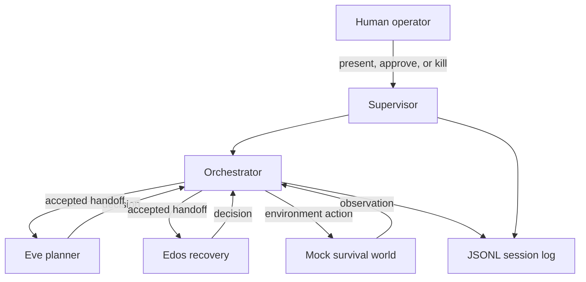
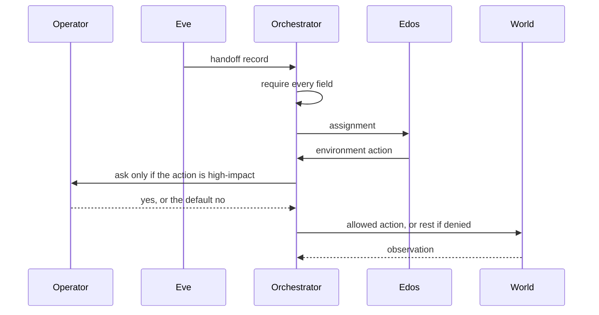
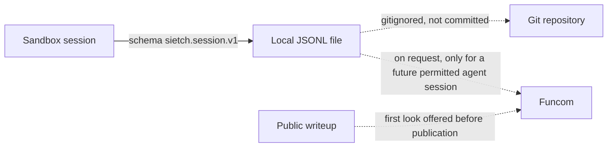
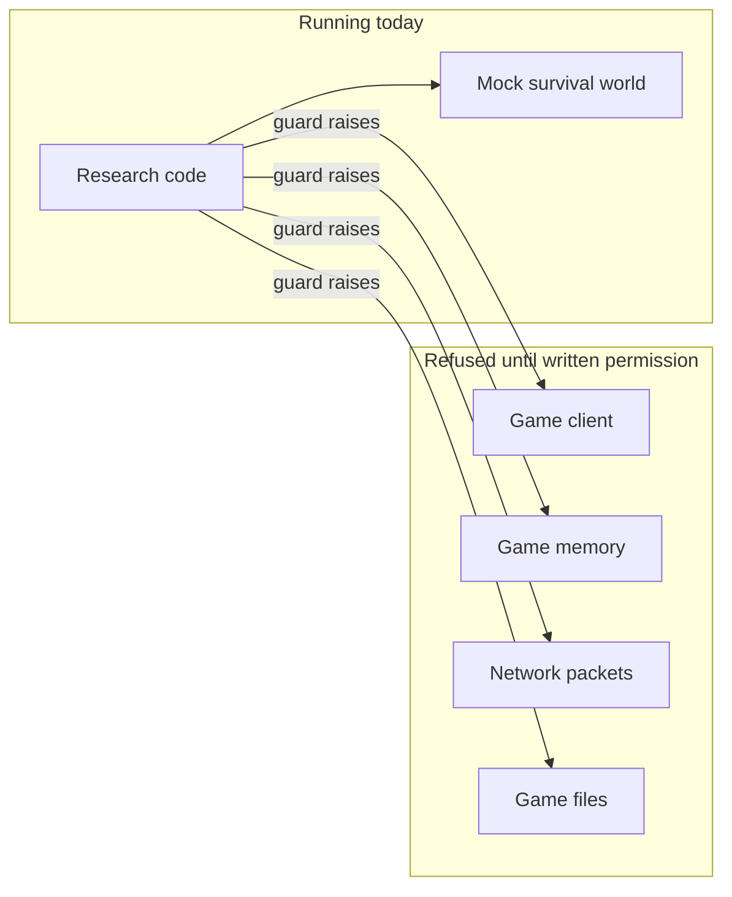
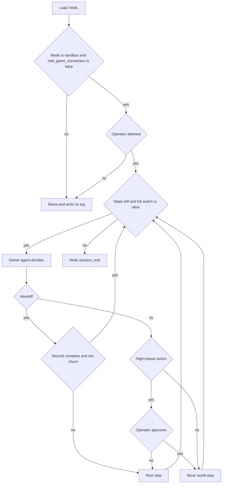

# Architecture

How the sandbox is put together, where logs go, and where a future game connection is refused. This describes the code in `scripts/`. It does not describe a live battlegroup. None is connected.

> **Permission status.** Written permission from Funcom has been requested and is pending. A follow-up was sent on 24 September 2026 (support ticket #308630). No agent will play in Dune: Awakening until a written answer is received. If the answer is no, the agents stay out. If the answer is yes with conditions, those conditions are followed. This project is not affiliated with, sponsored by, or endorsed by Funcom.

The module-level specification is [technical-spec.md](technical-spec.md). The agents are documented as a system card in [system-card.md](system-card.md). The logs are documented as a datasheet in [log-datasheet.md](log-datasheet.md).

## Collaboration

Eve and Edos never call the world directly. The orchestrator asks the agent who currently owns the task for a decision, asks the supervisor when a decision needs a person, and only then calls the mock world. A handoff changes the owner. It does not call the world.

Sequence for one handoff that then takes an action:

## Log flow

Sandbox logs stay on the machine that ran the session. They are not committed. The offer to give Funcom logs on request, and the offer of a first look at a public writeup, come from the permission request. They apply to the game study if it ever happens. They are not a claim that sandbox debug logs are shipped anywhere.

Storage, retention, and personal data for those future logs are open questions. Proposals are in [../methodology/data-handling.md](../methodology/data-handling.md).

## Safety boundary

The guard sits in front of the only environment factory. The right-hand side is not implemented. The diagram is the refusal, not a roadmap of hooks to build.

A written answer that allows a session would still have to name a method. That method is an open question. The request already rules out unauthorized clients, packet interception, memory editing, and anti-cheat circumvention. Those stay ruled out on both sides of the diagram.

## Process shape

The command-line process also installs a SIGINT handler that arms the kill switch between decisions.
